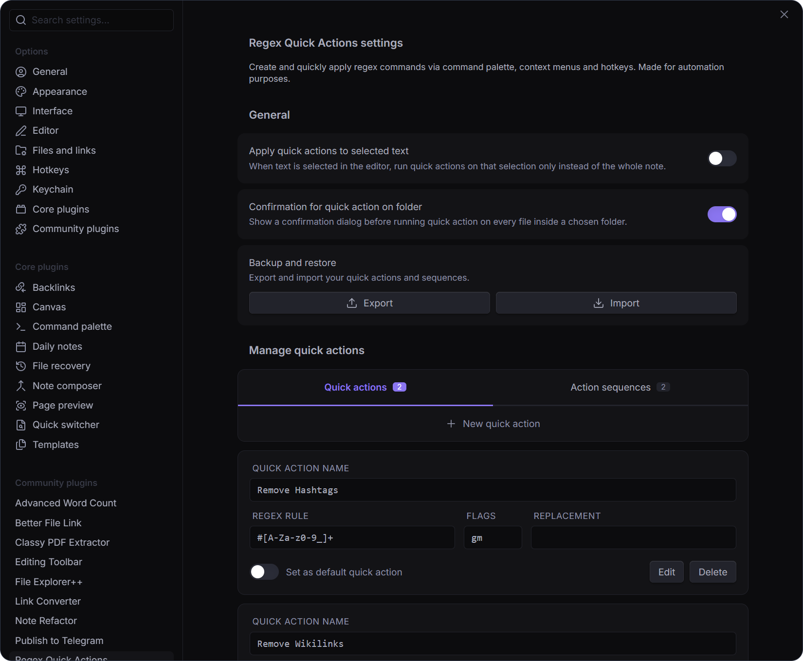

# Regex Quick Actions plugin

English | [Русский](https://github.com/pan4ratte/obsidian-regex-quick-actions/blob/master/README_RU.md)

This plugin allows you to create and quickly apply regex commands via command palette, context menus and hotkeys. Made for automation purposes.

## Features

### 1. Quick actions in every context

Create regex quick actions and run them from the command palette or with hotkeys. They can be applied to a single note as well as to every note in a chosen folder. Setting a default action is available too.

### 2. Prepare action sequences

Build chains of quick actions that run one after another. The actions in a sequence can be reordered, and the same action can be run any number of times in a row. Every saved sequence appears in the command palette and in the context menus of notes and folders.

### 3. Actions applied to selected text only

An option in the settings makes actions and sequences apply not only to the whole file, but also to the text currently selected in a note.

### 4. Backup and restore

Export and import your quick actions and sequences to a file. Export is available on desktop only, because of the platform's limits.

### 5. Reverting the last executed action

The "Revert last quick action" command in the palette undoes the most recent run as a whole, including runs over several files or over a whole folder.

## Installation

### Option 1: Obsidian plugin store

1. In Obsidian settings open the tab "Community plugins" and click "Browse" button.

2. In the search bar type `Regex Quick Actions`, click on the result, then "Install" and "Enable" buttons.

Alternatively, you can install the plugin by following the link to the community website: [https://community.obsidian.md/plugins/regex-quick-actions](https://community.obsidian.md/plugins/regex-quick-actions)

### Option 2: BRAT plugin

If you want to test beta-versions of the plugin or use previous versions, you can do that with `BRAT` plugin:

1. Install `BRAT` plugin from the official Obsidian plugin store.

2. In the `BRAT` settings, find the “Beta plugin list” section and click on the “Add beta plugin” button.

3. In the window that appears, paste the link to the `Regex Quick Actions` plugin repository: [https://github.com/pan4ratte/obsidian-regex-quick-actions](https://github.com/pan4ratte/obsidian-regex-quick-actions)

4. Under “Select a version” choose the desired version and click the “Add plugin” button. The plugin will be automatically installed and will be ready to use.

## About the Author

My name is Mark Ingram (Ingrem), I am a Religious Studies scholar. Apart from my main area of study (Protestant Political Theology in Russia), I teach the subject "Information Technologies in Scientific Research", a unique course that I developed myself from scratch. This plugin helps me in my studies and I use it in my teaching, as well as other plugins that I develop and that you can find in my GitHub profile.

Hello to every student that came across this page!

## Credits

Regex Quick Actions is a continuation of the idea of [Regex Pipeline](https://github.com/No3371/obsidian-regex-pipeline) plugin. While the base of the code was borrowed from it, now every line is original. Still, cheers to the authors for the inspiration and for making a quick start of this project possible.
