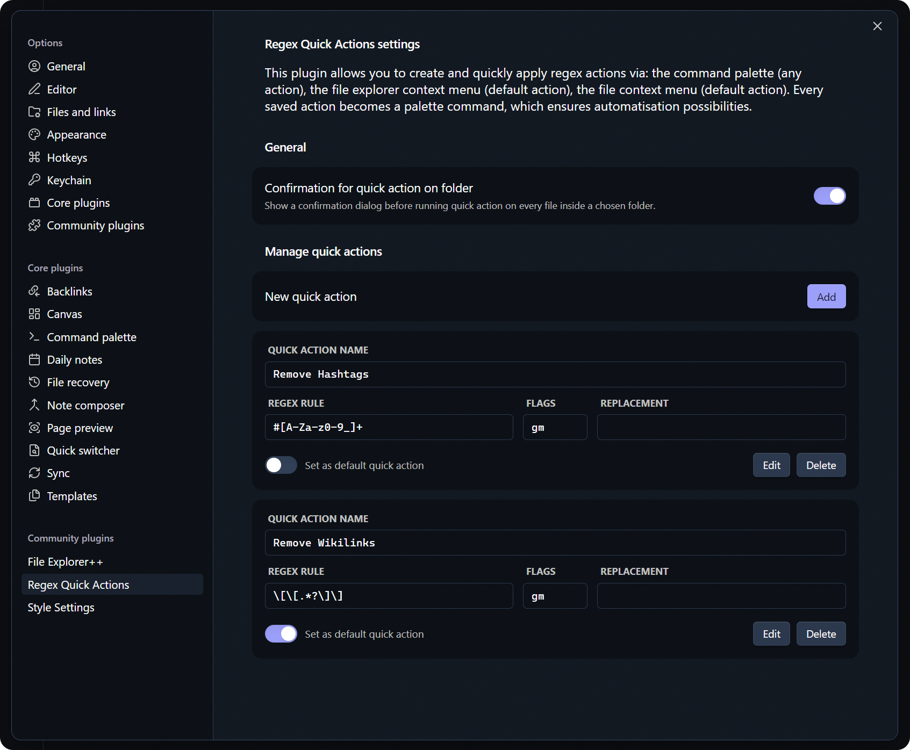

# Regex Quick Actions

[English](https://github.com/pan4ratte/obsidian-regex-quick-actions/blob/main/README.md) | Русский

Данный плагин позволяет создавать команды regex и быстро применять их в разных контекстах в Obsidian. Плагин был создан для целей автоматизации, поэтому он совместим с такими плагинами, как [Commander](https://github.com/phibr0/obsidian-commander).

Regex Quick Actions — это продолжение идеи плагина [Regex Pipeline](https://github.com/No3371/obsidian-regex-pipeline). Изначально, база кода была позаимствована из него, но сейчас практически каждая строчка кода является оригинальной. Тем не менее, выражаю признательность его авторам за вдохновение и за то, что сделали возможным быстрый старт этого проекта.

## Фичи

1. Создание быстрых команд regex их использование:

	- Из палитры команд.
	- Из контекстного меню файла в проводнике (команда по умолчанию).
	- Из контекстного меню папки в проводнике (команда по умолчанию, применяется ко всем файлам в папке).
	- Из контекстного меню активной заметки.
	- С помощью сочетаний клавиш.

2. Назначение команды по умолчанию для быстрого использования.

## Инструкции по установке

Пока плагин не появился в официальном магазине Obsidian, проще всего установить его через плагин `BRAT`:

1. Из официального магазина плагинов Obsidian установите плагин `BRAT`.

2. В настройках `BRAT` найдите раздел "Beta plugin list" и нажмите на кнопку "Add beta plugin".

3. В появившемся окне вставьте ссылку на репозиторий плагина `Regex Quick Actions`: [https://github.com/pan4ratte/obsidian-regex-quick-actions](https://github.com/pan4ratte/obsidian-regex-quick-actions)

4. В пункте "Select a version" выберите вариант "Latest version" и нажмите на кнопку "Add plugin".

Готово! Плагин автоматически установится и будет готов для использования.

## Дорожная карта

- [x] ~~Добавить русскую локализацию.~~

- [ ] Добавить возможность создавать последовательности команд для применения сразу нескольких команд regex.

- [ ] Добавить возможность экспорта/импорта настроек.

## Об авторе

Меня зовут Марк Ингрэм, я религиовед, и кроме своего основного направления исследований (протестантская политическая теология в России), я преподаю предмет "Информационные технологии в научных исследованиях" на основании своей собственной уникальной программы. Данный плагин помогает мне в исследованиях, а также я использую его в преподавании, как и другие плагины, которые я разрабатываю и которые вы можете найти в моём профиле на GitHub.

Привет всем студентам, которые зашли на эту страницу!